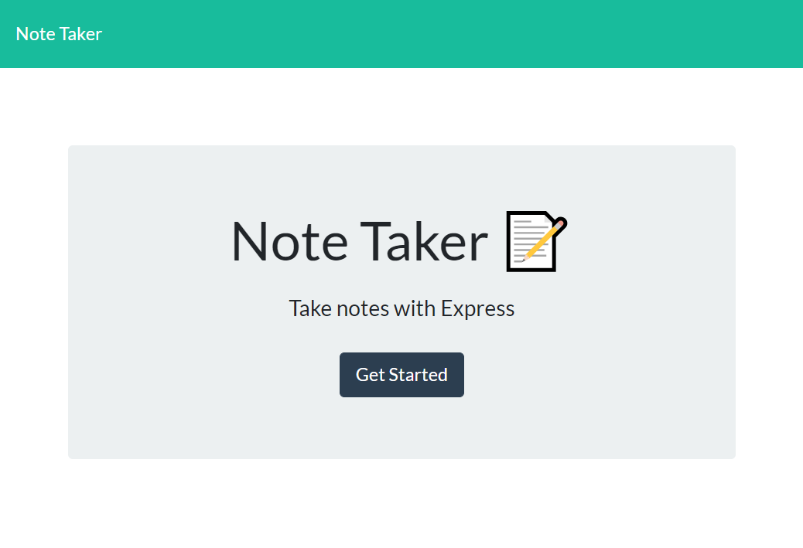
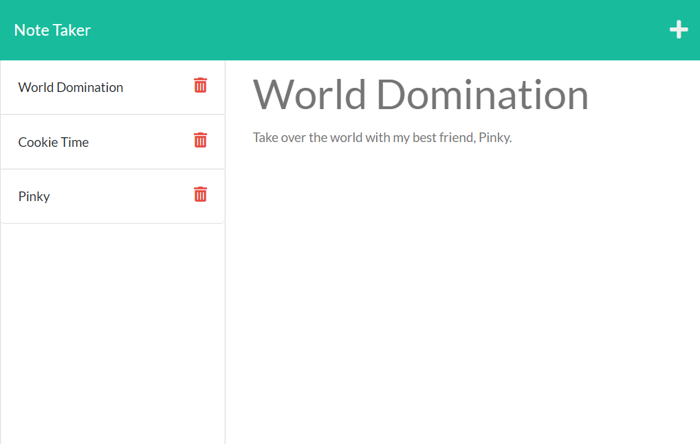

# Notebook


## Description
Many people use sticky notes or a notebook to help them remember something they learned, a task to complete later, or even little phrases of encouragement. Notebook is a full-stack note taking application that allows the user to write notes and save them online. The data is persistent so the user can access it from any device. This project utilizes HTML, CSS, [Bootstrap](https://getbootstrap.com/docs/5.2/getting-started/introduction/), [Node.js](https://nodejs.org/en/), [Express.js](https://expressjs.com/), and [uuid](https://www.npmjs.com/package/uuid). It is deployed via [Heroku](https://dashboard.heroku.com/apps).

### Screenshots




### Deployed Application

[title](https://ggorosave-notebook.herokuapp.com/)

## Table of Contents 

- [Installation](#installation)
- [License](#license)
- [Contributing](#contributing)
- [Questions](#questions)

## Installation

To install the necessary dependencies after cloning the repo, run the following conmmand(s):
  
```
npm install
```


## License

Copyright (c) 2022 Grant Gorosave

This project is licensed under the 	[MIT](https://github.com/ggorosave/Notebook/blob/main/LICENSE) license.

## Contributing

If you are interested in contributing to this project or have some ideas about how to improve it, you may fork this repository and make your desired changes. When you have finished, send a pull request and I will review it when I have a chance. 


## Questions

If you have any questions about the repo, contact me at [ggorosave@gmail.com](mailto:ggorosave@gmail.com). Find more of my work at [ggorosave](https://https://github.com/ggorosave).
